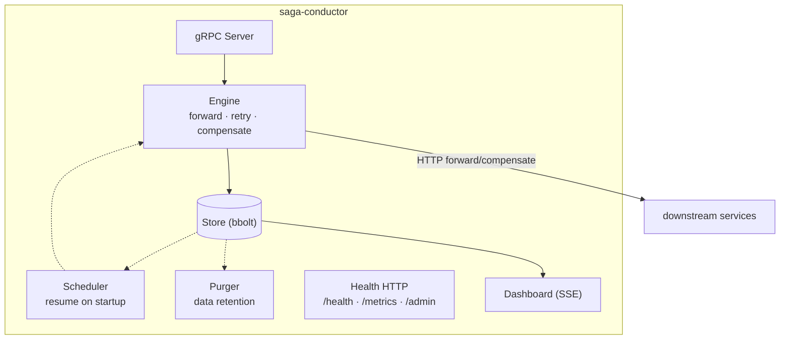
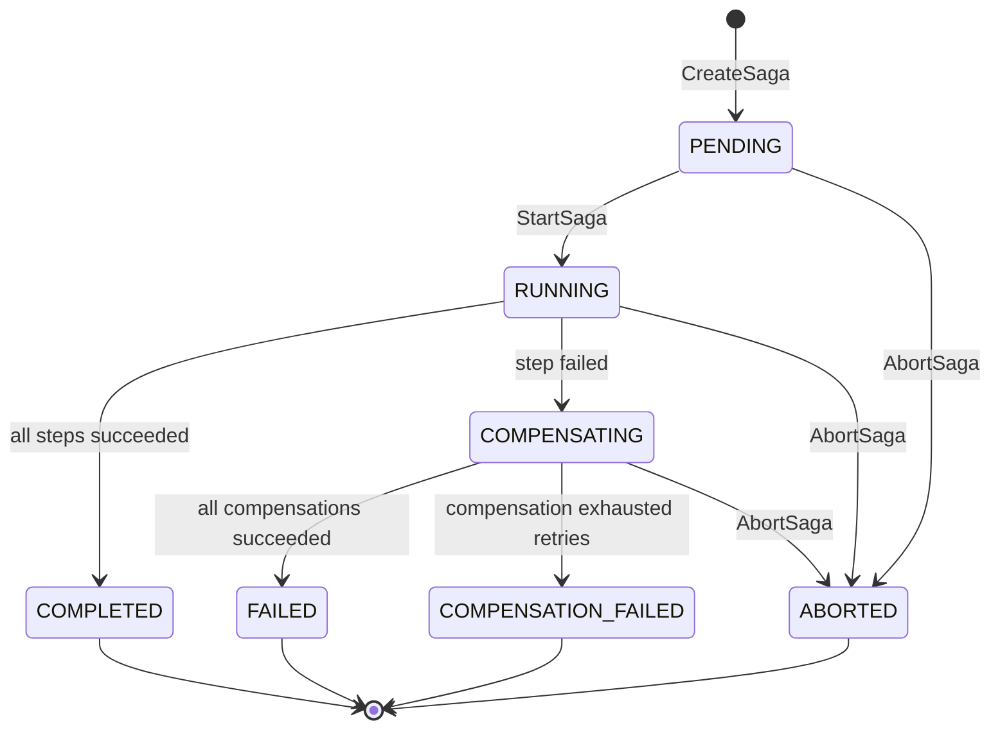
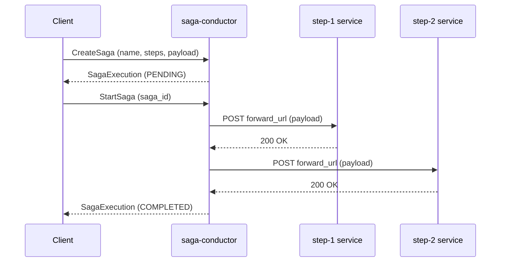
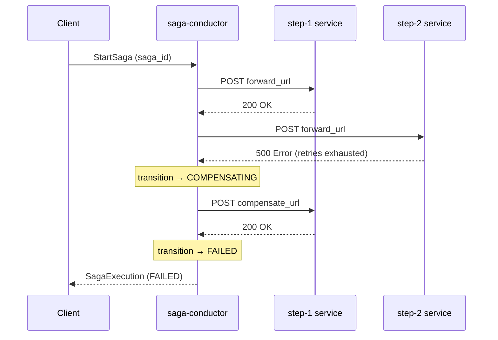

# Architecture

## Components



**gRPC Server** — handles inbound `CreateSaga`, `StartSaga`, `GetSaga`, `ListSagas`, and `AbortSaga` calls. Validates requests, maps errors to gRPC status codes.

**Engine** — the saga execution state machine. Drives steps forward, manages retries with exponential backoff, triggers compensation on failure, and enforces per-step and overall timeouts.

**Store (bbolt)** — embedded key-value store providing crash-safe persistence with no external dependencies. All saga state is serialised as JSON and stored in a single file.

**Scheduler** — runs once at startup. Finds any sagas left in `RUNNING` or `COMPENSATING` state by a previous crash and re-submits them to the engine.

**Purger** — background goroutine that periodically deletes sagas older than the configured retention window.

**Health HTTP** — `/health/live`, `/health/ready`, `/metrics`, and admin endpoints on a separate port.

**Dashboard** — serves a single-page HTML dashboard at `/dashboard`. The engine broadcasts every state transition over Server-Sent Events to all connected browsers.

## Saga state machine



## Step execution flow



## Compensation flow



## Retry behaviour

Each forward and compensating HTTP call is retried up to `max_retries` times (default 3) using exponential backoff with full jitter:

```
wait = random(0, base_backoff_ms * 2^attempt)
```

The retry budget applies independently to each step. Once a step exhausts its retries, compensation begins immediately.

## Crash recovery

bbolt flushes to disk after every write. On restart the Scheduler scans the store for sagas in non-terminal states and re-drives them through the engine. The engine is idempotent — re-calling a completed step's URL may produce a duplicate call to the downstream service, so downstream services should be idempotent on their side for forward steps.
