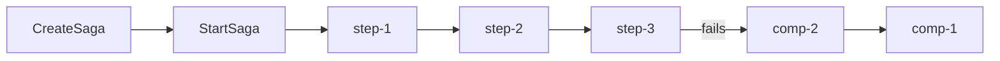

# Introduction

saga-conductor is a lightweight saga orchestrator for distributed transactions in Go. It coordinates sequences of HTTP calls across multiple services, automatically rolling back completed steps in reverse order when any step fails.

Single binary. No external database. gRPC API.

## The problem

Distributed transactions span multiple services. When a step fails partway through — a payment charge succeeds but inventory reservation fails — you need to undo the work already done. Without a coordinator, each service must track what to roll back and in what order. That logic ends up duplicated, inconsistent, and hard to test.

## The solution

The saga pattern gives distributed transactions the same properties as local ones: either all steps complete, or all completed steps are compensated. saga-conductor is the coordinator: it drives each step forward, detects failures, and triggers compensating actions in reverse order.

## Who it's for

saga-conductor is for teams that need reliable distributed transactions but not the operational complexity of Temporal, Apache Kafka Sagas, or a full workflow engine. If your saga shapes are fixed at deploy time and your transaction volume fits on a single machine, saga-conductor is the right fit.

> "Temporal for teams that don't need Temporal yet."

## Key features

- **gRPC API** — `CreateSaga`, `StartSaga`, `GetSaga`, `ListSagas`, `AbortSaga`
- **Automatic compensation** — failed steps trigger reverse compensation in order
- **Crash recovery** — in-flight sagas resume automatically on restart
- **Retry with backoff** — configurable per-step retries with exponential backoff and jitter
- **Per-step timeouts** — independent HTTP timeout per step
- **Overall saga timeout** — deadline for the whole saga execution
- **Pluggable auth** — static token, JWT, OIDC client credentials, SPIFFE SVID exchange; per-step overrides
- **mTLS** — optional SPIFFE X.509 SVID transport security on the gRPC listener
- **Prometheus metrics** — saga and step counters, latency histograms
- **OpenTelemetry tracing** — distributed traces with W3C traceparent propagation
- **Real-time dashboard** — browser SSE stream of live saga state
- **YAML definitions** — saga templates loaded from config files at startup
- **Go client library** — `pkg/client` wraps the gRPC API for consuming services
- **Data retention** — background purger removes old terminal sagas
